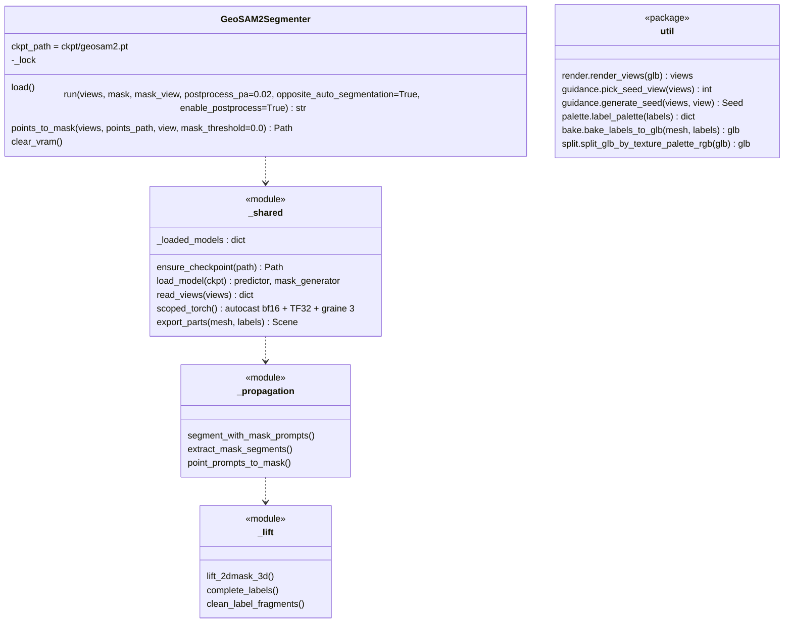
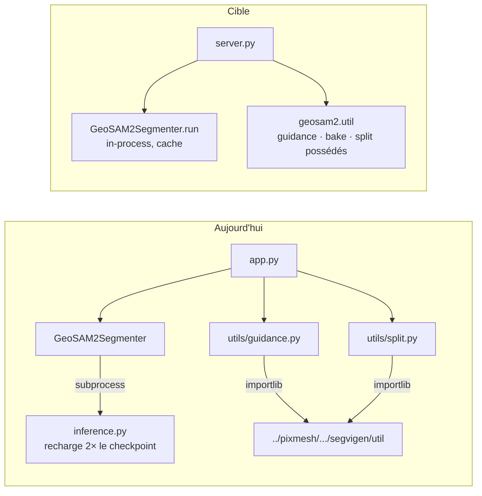

# Plan : faire de geosam2 une bibliothèque comme segvigen

But : que geosam2 soit pour GeoSAM2 ce que `segmentation/libraries/segvigen` est pour SegviGen. C'est une brique bas niveau, sans interface « produit » :

- des classes de segmentation `load()` / `run()` / `clear_vram()` ;
- un cache de modèles ;
- des utilitaires (rendu, guidage, split) ;
- son propre serveur de test.

pixmesh-segmentation la vendorisera ensuite dans `segmentation/libraries/geosam2`, à côté de segvigen, puis pixmesh dans `backend/src/libraries/geosam2`.

Contraintes :

- **Autonome.** Aucun import de segvigen, aucun checkout voisin, plus de `GEOSAM2_SEGVIGEN_DIR`. Le code repris de SegviGen (guidage, split) devient une copie possédée.
- **Cohabite avec segvigen dans le même processus.** Une fois les deux bibliothèques vendorisées côte à côte, aucun nom de premier niveau ne doit entrer en collision (voir § 2.3).
- **Sans régression.** Avant toute modification, les sorties du code actuel sur les maillages de test sont mises de côté ; chaque phase se termine par une comparaison dans l'application de test. Pas de nouveau test automatisé pour l'instant : ce sera un second temps.
- **Repackager n'est pas améliorer.** Tant que la bibliothèque n'est pas finie, aucun changement de comportement. Les améliorations (§ 8) viennent après et se comparent de la même façon.

---

## 1. Le modèle : ce qu'on a fait de SegviGen

| segvigen (dans pixmesh-segmentation) | Rôle | Équivalent geosam2 visé |
|---|---|---|
| `segvigen/__init__.py` | imports paresseux : `import segvigen` ne charge ni torch ni trellis2 | `geosam2/__init__.py`, même principe |
| `segvigen/full_guided.py` · `FullGuidedSegmenter` | GLB + carte 2D peinte → GLB segmenté ; **seul mode utilisé en production** | `geosam2/segmenter.py` · `GeoSAM2Segmenter.run()` : vues + masque 2D sur une vue → étiquettes par face |
| `segvigen/interactive.py`, `segvigen/full.py` | deux autres modèles, deux autres checkpoints | **pas d'équivalent** : GeoSAM2 n'a qu'un pipeline (§ 1.1) |
| `segvigen/_shared.py` | cache `_loaded_models`, chargement, I/O, export, `finalize` | `geosam2/_shared.py` : cache, chargement du checkpoint, lecture des vues, export des pièces, environnement torch limité à l'appel |
| `segvigen/_samplers.py` | la boucle d'échantillonnage | `geosam2/_propagation.py` (propagation vidéo SAM2) + `geosam2/_lift.py` (relèvement 2D → 3D, post-traitement) |
| `segvigen/presets.py` | `SAMPLER_PRESETS`, `SPLIT_PRESETS` | `geosam2/presets.py` : `SPLIT_PRESETS` (copie possédée) et les valeurs de `postprocess_pa` que VAST recommande (0.01, 0.02, 0.035) |
| `util/guidance.py` | vue, description VLM, palette, carte peinte | `geosam2/util/guidance.py` : copie possédée du sous-ensemble utilisé + le snap et les points |
| `util/split.py`, `util/_common.py` | texture → pièces | `geosam2/util/split.py`, `_common.py` : copie possédée, plus `bake.py` (étiquettes → texture) |
| `util/view.py` · `ViewGenerator` | rendus | `geosam2/util/render.py` : les 12 vues canoniques (pyrender) |
| `server.py` + `static/` | appli web par étapes | `server.py` + `static/` : l'`app.py` actuelle, **c'est l'application de test** |
| `ckpt/` gitignoré, `_ensure_checkpoint()` depuis HF | | `ckpt/geosam2.pt`, depuis `VAST-AI/GeoSAM2` (déjà fait) |
| `pyproject.toml`, `README.md`, `.env.dist`, `LICENSE` | | idem |

### 1.1 GeoSAM2 n'a qu'un seul pipeline

Contrairement à SegviGen (trois checkpoints, trois modèles), le code d'origine de VAST (`b5de23c`) n'a qu'un chemin : **un masque 2D sur une vue → propagation sur les 12 vues → relèvement 3D**. Ce que l'app appelle des « modes » sont les façons de fabriquer ce masque, ou des options de ce pipeline :

| Dans l'app | Réalité | Dans la bibliothèque |
|---|---|---|
| `seed_mode="map"` (défaut, production) | le masque est fourni tel quel (`--mask-path` accepte `.npy`/`.exr`/`.png` couleur) ; chez nous, c'est la carte peinte par le VLM | `run(views, mask, mask_view)` |
| `seed_mode="points"` | une **pré-étape** VAST (`single_view_point_prompt_infer.py`) qui fabrique le masque à partir de clics, avec le même checkpoint | `points_to_mask(views, points, view) → mask`, puis `run()` |
| complément automatique | `opposite_auto_segmentation` : le générateur de masques automatique de SAM2 sur la vue opposée (+6), **en plus** du masque ; activé par défaut | option `run(..., opposite_auto_segmentation=True)` |
| « automatique » sans masque | le code le permet, VAST ne le documente pas, et chez nous il ne produisait rien d'utilisable | non exposé ; `run()` exige un masque |

---

## 2. Cible

### 2.1 Arborescence

```text
geosam2/                          le dépôt GitHub = la bibliothèque, vendorisée telle quelle plus tard
│
├── geosam2/                      LE PACKAGE (seul nom de premier niveau)
│   ├── __init__.py               imports paresseux : GeoSAM2Segmenter, SPLIT_PRESETS
│   ├── segmenter.py              GeoSAM2Segmenter : load / run / clear_vram ; cache des poids,
│   │                             checkpoint HF, contexte torch (autocast, TF32, graine),
│   │                             export des pièces sur le maillage d'entrée (+ clean_label_fragments)
│   ├── _model.py                 le modèle construit en Python (M2 : ex build_sam.py + geosam2.yaml),
│   │                             un seul SAM2 partagé par la propagation et le générateur automatique (M3)
│   ├── _propagation.py           lecture des 12 vues, masque → propagation vidéo, complément automatique
│   ├── _lift.py                  relèvement 2D → 3D, complete_labels, clean_label_fragments
│   ├── ext/
│   │   └── mode_ext.cpp          vote des étiquettes ; compilé par setup.py, plus à l'import
│   ├── sam2/                     SAM2 modifié par GeoSAM2, élagué (≈ 1 300 lignes de moins)
│   │   ├── __init__.py           vide : plus d'initialisation Hydra
│   │   ├── automatic_mask_generator.py
│   │   ├── image_predictor.py    réduit à ce que le générateur automatique appelle
│   │   ├── video_predictor.py    sans la variante VOS
│   │   ├── modeling/
│   │   │   ├── sam2_base.py
│   │   │   ├── memory_attention.py
│   │   │   ├── memory_encoder.py
│   │   │   ├── position_encoding.py
│   │   │   ├── feature_fusion.py
│   │   │   ├── sam2_utils.py     sans l'échantillonnage de points d'entraînement
│   │   │   ├── backbones/        hieradet.py, image_encoder.py, utils.py
│   │   │   └── sam/              lora.py, mask_decoder.py (sans 2ioupred), prompt_encoder.py, transformer.py
│   │   └── utils/
│   │       ├── amg.py            sans les RLE COCO
│   │       ├── misc.py           sans decord ni chargeurs vidéo
│   │       └── transforms.py
│   └── util/
│       ├── render.py             les 12 vues canoniques (pyrender), outils de validation Blender compris
│       ├── guidance.py           vue, description VLM, palette, carte peinte, snap (sans .env à l'import)
│       ├── bake.py               palette par id + étiquettes → texture sur les UV
│       ├── split.py              split + _common + SPLIT_PRESETS (copie possédée de SegviGen)
│       └── logs.py
│
├── server.py                     l'application de test : 4 étapes (M8) render → guidage → segment → split
├── static/
│   └── index.html
│
├── tests/                        les deux fichiers existants, inchangés (imports mis à jour)
│   ├── test_palette.py
│   └── test_geometry_cleanup.py
│
├── example/                      sample_00, sample_01, sample_02 : vues, maillage, masques (fixtures)
├── ckpt/                         gitignoré ; geosam2.pt téléchargé depuis VAST-AI/GeoSAM2 au premier run
├── docs/
│   └── repackaging-plan.md
│
├── pyproject.toml                nom pixmesh-geosam2, dépendances (sans hydra, omegaconf, iopath, pandas, matplotlib)
├── setup.py                      compile mode_ext ; plus de sam2._C (D8)
├── .env.dist                     GEMINI_API_KEY, GEOSAM2_DESCRIBE_MODEL, GEOSAM2_PAINT_MODEL, hôte/port
├── .gitignore
├── README.md
├── LICENSE                       Apache-2.0 (VAST)
└── NOTICE
```

Ce qui n'y est plus, par rapport à aujourd'hui : `inference.py`, `single_view_point_prompt_infer.py`, `utils/`, `sam2/` à la racine et ses `configs/` et `csrc/`, `scripts/`, `assets/`, `requirements.txt` (les dépendances vivent dans `pyproject.toml`, comme segvigen), `app.py`.

D'où vient chaque fichier (les dossiers de droite sont ceux d'**aujourd'hui**, qui disparaissent) :

| Cible | Aujourd'hui |
|---|---|
| `geosam2/_propagation.py` | `inference.py` (segment_with_mask_prompts, read_data, masques) |
| `geosam2/_lift.py` | `utils/inference_utils.py` |
| `geosam2/segmenter.py` | `utils/segmenter.py` (checkpoint, `_build_scene`) + `init_env()` d'`inference.py` |
| `geosam2/_model.py` | `sam2/build_sam.py` + `sam2/configs/geosam2.yaml` |
| `geosam2/sam2/` | `sam2/` à la racine |
| `geosam2/ext/mode_ext.cpp` | `utils/mode_ext.cpp` |
| `geosam2/util/render.py` | `utils/render.py` |
| `geosam2/util/guidance.py` | `utils/guidance.py` + le sous-ensemble utilisé de SegviGen `util/guidance.py` (le snap est le sien ; `auto_prompt` disparaît avec M1) |
| `geosam2/util/bake.py` | `utils/split.py` (`label_palette`, `to_linear_u8`, `bake_labels_to_glb`) |
| `geosam2/util/split.py` | SegviGen `util/split.py` + `util/_common.py` (parties atteintes) + `SPLIT_PRESETS` |
| `geosam2/util/logs.py` | `utils/logs.py` |
| `server.py` + `static/` | `app.py` + `static/index.html` |

### 2.2 La classe

Une seule, avec le même cycle de vie que les segmenteurs de segvigen :

- chargement paresseux ;
- un verrou par instance ;
- `clear_vram()` dans un `finally` ;
- des poids en cache au niveau du module, partagés entre instances ;
- le checkpoint téléchargé s'il manque.



`run()` renvoie le chemin d'un GLB, comme segvigen : une géométrie par étiquette, dans le repère du maillage d'entrée, après `clean_label_fragments`. Les étiquettes par face sont écrites à côté, même nom, extension `.npy` (les brutes et les post-traitées, puisque l'app compare les deux). Le reste de la chaîne se compose à l'extérieur, exactement comme `MeshSegvigenSegmenter` compose `util.guidance`, `FullGuidedSegmenter` et `util.split` :

```python
from geosam2 import GeoSAM2Segmenter
from geosam2.util import render, guidance, bake, split

views = render.render_views("sideboard.glb", work_dir)
view  = guidance.pick_seed_view(views)
seed  = guidance.generate_seed(views, view)                    # VLM : description, palette, carte
parts = GeoSAM2Segmenter().run(views, seed.map_path, view)     # GeoSAM2, modèle gardé en cache
labels = np.load(Path(parts).with_suffix(".npy"))
baked = bake.bake_labels_to_glb(views / "mesh.glb", labels, work_dir / "baked.glb")
final = split.split_glb_by_texture_palette_rgb(baked, work_dir / "parts.glb", **SPLIT_PRESETS["balanced"])
```

### 2.3 Cohabitation avec segvigen : le seul vrai écart au modèle

segvigen expose deux noms de premier niveau, `segvigen` et `util`. `MeshSegvigenSegmenter` ajoute la racine de la bibliothèque à `sys.path`, et `segvigen/_shared.finalize` fait `from util.remap import ...`.

Si geosam2 exposait lui aussi `util` ou `sam2` au premier niveau, le module chargé dépendrait de l'ordre de `sys.path` dès que les deux bibliothèques seraient vendorisées côte à côte. Pour `sam2`, il y aurait en plus une collision avec le `sam2` de Meta.

geosam2 n'exposera donc **qu'un seul** nom de premier niveau, `geosam2`, avec `sam2` et `util` en dessous.

### 2.4 Package minimal : ce qui est réellement utilisé

Mesuré avec `coverage` sur le chemin de production du commit `5b04ebb` (sample_01) :

- carte fournie en masque ;
- propagation avec le complément automatique ;
- post-traitement et nettoyage des fragments ;
- export des pièces ;
- bake, puis split avec le preset `balanced`.

S'y ajoutent le chemin points (sample_00) et le rendu. Le guidage VLM n'a pas tourné, pour ne pas payer d'appels ; il est analysé statiquement à partir des six fonctions que geosam2 appelle. Un seul échantillon ne suffit pas à prouver qu'un code est mort : chaque retrait se vérifie dans l'application de test sur tous les cas.

| Zone | Jamais exécuté | Décision |
|---|---|---|
| `scripts/geosam2_render.py` | tout (803 l., Blender) | **retiré** |
| `inference.py` | visualisations `save_frame_segmentation_visualizations`, `save_input_maps_visualizations`, `save_labeled_point_cloud*`, `_to_int_label_map`, options `--save-*` (≈ 145 l.) | **retiré** ; `matplotlib` disparaît avec |
| `utils/inference_utils.py` | `eval_per_shape_part_mean_iou`, `compute_intersect_mask1`, `show_mask`, `norms_mask`, `find_most_frequent`, `trimesh_to_blender`, `blender_to_trimesh`, `export_labelled_mesh` (137 l.) ; la branche de tracé de `show_anns` | **retiré** ; `show_anns` garde son filtrage (production) sans le tracé |
| `sam2/` (SAM2 vendorisé) | `SAM2VideoPredictorVOS` (compilation), `MaskDecoder_2ioupred`, échantillonnage de points d'entraînement (`sam2_utils`, 162 l.), chargement de vidéos/JPEG et `decord` (`misc`, 258 l.), API `predict`/`predict_batch` de l'image predictor (214 l.), prompts par boîtes (≈ 1 300 l. au total) | **élagué**, à condition que le checkpoint se charge à l'identique (`strict=True`) et que les sorties restent identiques |
| Guidage SegviGen | `generate_guidance_map`, `_render_views`, `pick_backdrop`, `_look_at_matrix` (244 l. sur 881) | **non copiés** : on ne reprend que les 637 lignes atteintes ; la dépendance à `ViewGenerator` disparaît |
| Split SegviGen | `postprocess_split_glb`, `_pass`, `_rebuild_node` (≈ 230 l., jamais appelés par geosam2) ; `_StageDump` (vidage de débogage, ≈ 200 l.) ; `collapse_islands_to_majority`, `_absorb_label_enclaves` (atteints seulement si `island_majority` / `cleanup_fragments`, désactivés par défaut) | premiers **non copiés** ; les deux options : **D7** |
| `utils/render.py` | outils de validation contre Blender (`compare_views`, `validate`, `write_comparison_images`, CLI `main`, ≈ 200 l.), `shaded_view` | **gardés en place** pour l'instant (ils servent à comparer deux rendus) ; `shaded_view` retiré |
| `utils/segmenter.py` | le pilotage des sous-processus (`_run_logged`, `_tail`, `_find_labels`, `_run_*`) | **remplacé** par le in-process |
| Divers | `auto_prompt.summarize`, `split.labels_to_parts`, `--mask-root` | **retirés** |
| Dépendances | `pandas` (**importé nulle part**), `matplotlib` (visualisations seules) | **retirées** |
| `sam2._C` (CUDA, `setup.py`) | **pas compilé dans l'env actuel** : les résultats d'aujourd'hui sont produits *sans* `fill_holes_in_mask_scores` | **D8** : ne pas le compiler, par fidélité ; l'activer est une amélioration à mesurer |
| `mode_ext` | utilisé (vote des étiquettes dans le relèvement) ; compilé en JIT, et il faut `ninja` dans le `PATH` (le run échoue sinon, vérifié) | gardé, compilé à l'installation |
| `example/`, `assets/*.png` | données de démo, images du README | hors du package installé ; `example/` sert de cas de référence |

Sont utilisés à 100 % ou presque, et gardés : le cœur du modèle (`sam2_base_geosam2`, `memory_*`, `lora`, `feature_fusion`, `transformer`, `hieradet`), le générateur automatique, `auto_prompt` (hors `summarize`), la palette et le bake, `logs`.

Dernier gaspillage, qui n'est pas du code mort : le checkpoint est chargé **deux fois** (`build_sam2` pour le générateur automatique, `build_sam2_video_predictor_geosam2` pour la propagation). On le garde tel quel pour la fidélité ; partager les poids est une optimisation mesurée (§ 8).

### 2.5 Fusions proposées pour réduire la complexité

Chacune est une décision à part (M1 à M9). Aucune ne change le résultat, sauf mention, et toutes se vérifient en comparant les sorties. Les gains en lignes sont ceux mesurés en § 2.4.

| # | Fusion | Ce que ça supprime | Fidélité | Recommandation |
|---|---|---|---|---|
| **M1** | **Abandonner le chemin points** (`points_to_mask`, donc D4 tranchée dans l'autre sens) | `single_view_point_prompt_infer.py` (192 l.), `auto_prompt.py` en entier (203 l. : en mode carte, les points qu'il écrit ne sont jamais lus), `_resolve_seed_view` et `_prompt_frames` (≈ 50 l.), l'option `points_per_part`, la branche points de l'app. Un concept de moins dans l'API. | aucun effet sur le chemin carte | **Oui.** La mesure sur les deux buffets (commentaire de `SegmentParams`) disait déjà que la carte garde 15/15 pièces contre 11 pour les clics. Le protocole du papier reste dans l'historique git. |
| **M2** | **Construire le modèle en Python, sans Hydra** : `build_sam2` devient un constructeur qui instancie les 20 `_target_` de `geosam2.yaml` (146 l.) | `hydra-core`, `omegaconf`, `iopath` (seulement utilisé pour un chemin de poids pré-entraînés dans `hieradet`, jamais à l'inférence), le YAML, l'initialisation globale de Hydra à l'import, la réécriture des `_target_` | identique : mêmes classes, mêmes hyperparamètres ; `load_state_dict(strict=True)` le garantit | **Oui**, en phase 2 |
| **M3** | **Un seul modèle** : passer le prédicteur vidéo (un `SAM2Base`) au générateur automatique au lieu de construire un second `SAM2Base` | un chargement du checkpoint sur deux, la moitié de la VRAM du modèle | mêmes poids ; à vérifier, car l'image predictor et le prédicteur vidéo partagent alors une instance | **Oui**, en phase 3, dans un commit à part pour qu'un écart lui soit attribuable |
| **M4** | **`_shared.py` fondu dans `segmenter.py`** : avec une seule classe, un module « partagé » n'a plus de raison d'être | un module | aucun | **Oui** |
| **M5** | **`_common.py` fondu dans `split.py`** (seules ses fonctions atteintes), **`palette.py` fondu dans `bake.py`**, **`presets.py` fondu** (`SPLIT_PRESETS` dans `split.py`, les valeurs de `postprocess_pa` à côté de `run()`) | trois modules ; l'argument « importable sans torch » de segvigen ne s'applique pas : `split.py` ne dépend que de numpy/scipy/cv2 | aucun | **Oui** |
| **M6** | **Un seul nettoyage des fragments** : `inference.py` a un `--clean-fragments` qui écrit sous `clean/`, et `_build_scene` refait le même appel à `clean_label_fragments` ; l'app n'utilise que le second | un chemin dupliqué, l'option et son dossier | aucun (le chemin retiré n'est jamais exécuté) | **Oui** : `export_parts` est le seul endroit |
| **M7** | **`run()` sans `enable_postprocess` ni `opposite_auto_segmentation`** : l'app les fixe toujours à `True`, et `run()` sans masque n'existe plus | deux paramètres, la validation « sans masque il faut l'auto », les branches `else` correspondantes dans `_propagation` | aucun sur le chemin de production | **Oui**. Il reste `postprocess_pa`, le seul réglage qui compte (README de VAST) |
| **M8** | **L'app passe de six étapes à quatre** : « choisir la vue » entre dans « guidage » (option vue : automatique ou numéro), « bake » entre dans « split » (le GLB cuit est toujours écrit et visible) | deux jobs, deux panneaux | aucun | **Oui** |
| **M9** | **Vues en mémoire** : `render_views` rend des tableaux, `run()` les consomme sans passer par webp/EXR ; une méthode `write()` garde le format disque pour l'app et les références | l'aller-retour disque, la contrainte `opencv<5` + `OPENCV_IO_ENABLE_OPENEXR` (plus d'EXR à lire), `read_data` | **peut** être identique : les webp sont sans perte et les EXR en float32, il suffit de quantifier les normales en 8 bits en mémoire comme à l'écriture | **Plus tard** : ça change le contrat de `run(views)` et touche au cœur de `read_data` ; à faire une fois le package stable |

L'arborescence du § 2.1 est celle qui résulte de M1 à M8.

### 2.6 Ce qui disparaît du fonctionnement actuel



---

## 3. État des lieux : ce qui bloque aujourd'hui (commit `5b04ebb`)

| Sujet | Aujourd'hui | À faire |
|---|---|---|
| Dépendance SegviGen | `utils/guidance.py` et `utils/split.py` chargent `../pixmesh/backend/src/libraries/segvigen/util/*` par chemin, ainsi que `segvigen/presets.py`. Cette copie a encore le resize `LANCZOS` dans `_vlm_segment`, que pixmesh-segmentation a corrigé en `NEAREST`. | Copier dans `geosam2/util` ce que geosam2 atteint de `split.py`, `_common.py` (numpy/scipy/trimesh/cv2 uniquement) et `guidance.py`, ainsi que `SPLIT_PRESETS` (§ 2.4) |
| Inférence | `inference.py` et `single_view_point_prompt_infer.py` en sous-processus ; `build_sam2` + `build_sam2_video_predictor_geosam2` chargent le checkpoint deux fois à **chaque** appel | Classes in-process, poids en cache |
| État global torch | `init_env()` : `torch.autocast(bf16).__enter__()` jamais refermé, TF32 activé, graines 3 | Le tout limité à l'appel, dans un `with` ; graine remise à 3 à chaque `run()` |
| Hydra | `sam2/__init__.py` l'initialise globalement à l'import ; les YAML ciblent `sam2.modeling...` | Composition explicite dans `load()` ; `_target_` réécrits en `geosam2.sam2...` |
| Noms de premier niveau | `sam2`, `utils` | Sous `geosam2` (§ 2.3) |
| `mode_ext` | `cpp_extension.load()` compile à l'import (il faut un compilateur et `ninja` dans le `PATH`) ; départage des égalités lié à l'ordre d'une `unordered_map`, non reproductible en torch | Source inchangée, compilée par `setup.py` à l'installation (`CppExtension`) ; la construction de `sam2._C` passe à « désactivée par défaut » (D8) |
| Contrat entre étapes | sorties `segmentation_result_*.npy` / `segmentation_postprocessed_*.npy` retrouvées par glob | `run()` renvoie des chemins explicites |
| Effets de bord à l'import | `utils/guidance.py` fait `load_dotenv(.env)` et pose `LOGFIRE_IGNORE_NO_CONFIG` dès l'import | Une bibliothèque ne lit pas de `.env` : c'est `server.py` qui le charge (comme le `server.py` de segvigen) ; les modèles VLM (`GEOSAM2_DESCRIBE_MODEL`, `GEOSAM2_PAINT_MODEL`) et la clé sont lus dans `os.environ` au moment de l'appel |
| Dépendances | `opencv-python<5` ; `pydantic-ai>=2.11` (2.48 installé) ; l'env a à la fois `opencv-python 4.14` et `opencv-python-headless 5.0` | Tenir dans les épingles de pixmesh-segmentation : `pydantic-ai-slim<2.32`, `opencv-python-headless<5` + `OPENCV_IO_ENABLE_OPENEXR=1` (les profondeurs sont en EXR), numpy 2 ; ajouter `hydra-core`, `omegaconf`, `iopath` |
| Code mort | voir § 2.4 | Retiré en phase 4 |

Ce qui se garde tel quel :

- `render.py` (IoU de silhouette 99,51 % contre Blender) ;
- `auto_prompt.py` ;
- la palette par id ;
- `clean_label_fragments` ;
- l'export dans le repère de l'entrée ;
- `ensure_checkpoint`.

---

## 4. Le contrôle de non-régression : l'application de test

Pas de harnais automatisé dans ce plan ; il viendra dans un second temps. Le contrôle repose sur deux choses.

### 4.1 Les sorties d'aujourd'hui, mises de côté

Avant la première modification, l'app actuelle (commit `5b04ebb`) tourne une fois sur chaque maillage de test (D5), et ses sorties sont copiées hors du dépôt, dans `~/geosam2-reference/<cas>/` :

- les 12 vues et `meta.json` ;
- la carte peinte et la description du VLM (c'est la partie payante et non déterministe : on la **réutilise** telle quelle ensuite, on ne la regénère pas) ;
- les étiquettes brutes et post-traitées (`.npy`) ;
- le GLB des pièces, la texture cuite, le GLB du split.

Deux runs d'affilée sur le même cas, pour savoir si GeoSAM2 est reproductible au bit près sur cette machine ; c'est ce qui dit si un écart ultérieur est significatif.

### 4.2 L'application de test

`app.py` devient `server.py`, comme dans segvigen, sur le port 7862, avec quatre étapes (M8) : render → guidage → segment → split.

Elle n'appelle plus que ce que la bibliothèque rend public. Il n'y a donc plus de `_segmenter._run_inference`, de `_build_scene` ni d'import par chemin. Elle sait :

- repartir d'une carte peinte existante (celle mise de côté en 4.1), pour ne pas rappeler le VLM ;
- charger un GLB de référence à côté du résultat courant, pour comparer à l'œil ;
- afficher les chiffres qui trahissent une régression sans avoir à regarder : nombre de pièces, faces par pièce, faces non assignées, et l'égalité (ou non) des `.npy` avec la référence.

Tant que la migration dure, elle propose le choix du runner (ancien code, nouvelle bibliothèque) sur le même maillage.

### 4.3 Deux vérifications propres au passage en in-process

À faire à la main dans un interpréteur, à la fin de la phase 3 :

- deux `run()` successifs sur la même instance donnent le même `.npy` (cache et graine corrects) ;
- après `run()`, `torch.is_autocast_enabled()` est faux et les drapeaux TF32 ont leur valeur d'avant (aucune fuite dans le processus hôte).

---

## 5. Décisions à valider

| # | Question | Recommandation | Alternative |
|---|---|---|---|
| D1 | Où ? | **Sur place, dans le fork geosam2, sur une branche.** Le fork devient la bibliothèque, comme SegviGen-app l'est pour segvigen. | Un nouveau dépôt |
| D2 | Noms de premier niveau | **Uniquement `geosam2`**, avec `sam2` et `util` en dessous (§ 2.3) | Calquer segvigen (`util` au premier niveau) : collision assurée |
| D3 | Code repris de SegviGen | **Copie possédée**, provenance en tête de fichier. On part de la version qui tourne aujourd'hui (celle de pixmesh) ; le correctif `NEAREST` fait l'objet d'un commit séparé. | Synchronisation à sens unique depuis pixmesh-segmentation |
| D4 | Points | **Garder `points_to_mask()`** : c'est le protocole du papier, il tourne avec le même checkpoint et sert de référence face à la carte peinte | Ne garder que la carte peinte |
| D5 | Maillages de référence | Les 3 `example/sample_*`, les 2 buffets déjà mesurés (15/15 pièces), et 1 ou 2 maillages réels de pixmesh | Les exemples seuls |
| D6 | Environnement | **L'env `segmentation`** (Python 3.10, torch 2.9.1), celui de pixmesh-segmentation : la bibliothèque doit y tourner à côté de segvigen. Les références restent celles de l'env `geosam2`, et la phase 5 mesure l'écart dû à l'environnement avant celui dû au code | Garder l'env `geosam2` : l'intégration découvrira les conflits plus tard |
| D7 | Options `island_majority` et `cleanup_fragments` du split | **Les retirer** si tu ne t'en sers pas ; elles tirent environ 120 lignes | Les garder dans l'app de test comme expériences |
| D8 | `sam2._C` | **Ne pas le compiler** : c'est le comportement d'aujourd'hui | Le compiler et mesurer l'effet de `fill_holes` |

---

## 6. Phases

Chaque phase se termine par une comparaison des sorties avec la référence (§ 4.1) sur tous les cas. Les phases 0 à 3 se font dans l'env `geosam2`, celui des références ; le changement d'env est la phase 5.

| Phase | Contenu | Risque | Critère de sortie |
|---|---|---|---|
| **0. Référence** | Les sorties d'aujourd'hui mises de côté (§ 4.1), deux runs par cas pour mesurer la reproductibilité | faible | un dossier de référence par cas ; l'écart run à run connu |
| **1. Autonomie** | Copier dans `utils/` (encore à l'ancienne place) ce que § 2.4 retient de split, `_common`, `SPLIT_PRESETS` et guidance ; supprimer `SEGVIGEN_DIR` | faible | sorties identiques ; plus aucune occurrence de `pixmesh` ni de `segvigen` dans le code |
| **2. Arborescence** | Créer `geosam2/` et y déplacer les modules ; `sam2` → `geosam2.sam2` (imports et `_target_` YAML) ; Hydra sans effet de bord ; `app.py` → `server.py`. Les scripts CLI restent comme enveloppes | moyen (mécanique) | sorties identiques ; `import geosam2` ne charge pas torch |
| **3. In-process** | `_shared` : cache, contexte torch limité à l'appel ; `GeoSAM2Segmenter` ; suppression des sous-processus ; `mode_ext` compilé par `setup.py` | **élevé** | sorties identiques ; les deux vérifications de § 4.3 |
| **4. Élagage** | Retirer ce que § 2.4 liste : visualisations, évaluation, helpers Blender, classes et chargeurs inutilisés de `sam2/`, `pandas`, `matplotlib`, puis le legacy (`inference.py`, `single_view_*`, `scripts/geosam2_render.py`, `utils/`, `sam2/` à la racine) | faible | sorties identiques après chaque retrait ; `grep` ne trouve plus `matplotlib`, `pandas`, `decord`, `hydra` |
| **5. Empaquetage** | `pyproject`, dépendances dans les épingles de pixmesh-segmentation, README. Installation dans l'env `segmentation` en **deux temps** : d'abord l'ancien code dans cet env (pour isoler l'effet de l'environnement de celui du code), puis la bibliothèque. Import de `segvigen` et de `geosam2` dans le même processus | moyen (dépendances) | sorties identiques dans l'env `segmentation` ; `pip install -e .` suffit |
| 6. Vendorisation (plus tard) | `segmentation/libraries/geosam2` + `sync_with_pixmesh.py` (FORKS) ; un module `MeshGeosam2Segmenter` à côté de `MeshSegvigenSegmenter` | — | hors périmètre |

---

## 7. Risques et parades

| Risque | Parade |
|---|---|
| L'autocast bf16 global fuit dans l'hôte | `with` par appel ; vérification § 4.3 |
| TF32 et graines globaux | Sauvegardés et restaurés ; graine remise à 3 à chaque `run()`, comme un sous-processus neuf |
| Hydra initialisé à l'import | Composition dans `load()`, puis `GlobalHydra.clear()` si c'est nous qui l'avons initialisé |
| `util` ou `sam2` masqués par segvigen, ou par le `sam2` de Meta | Un seul nom de premier niveau (D2) ; test d'import croisé en phase 4 |
| Départage de `mode_ext` | Source C++ inchangée ; tout remplacement est une amélioration mesurée |
| Codec EXR absent | Épingle `<5`, `OPENCV_IO_ENABLE_OPENEXR=1` posé avant `import cv2`, test de fumée sur un `depth_*.exr` |
| Ordre des faces modifié | Un seul chargeur de maillage ; le nombre de faces par pièce est affiché dans l'app |
| pydantic-ai `<2.32` | La même guidance tourne déjà sous ces épingles dans pixmesh-segmentation ; un run avec VLM en phase 5 le confirme |
| VRAM partagée avec SegviGen (7,9 Go) | `clear_vram()` de part et d'autre ; GeoSAM2 est petit (615 Mo, existe en bf16) |

---

## 8. Après : pistes d'amélioration, à comparer de la même façon

- Découper directement sur les étiquettes par face, sans la texture cuite puis décodée.
- Nommer les pièces avec les noms du VLM (la palette relie une couleur à un nom) plutôt que `part_003`.
- Garder les vues en mémoire, sans aller-retour webp/EXR (M9).
- Remplacer `mode_ext` par un mode déterministe en torch.
- Resize `NEAREST` dans `_vlm_segment`.
- Écart de 23 pièces contre 24 dans le renderer.
